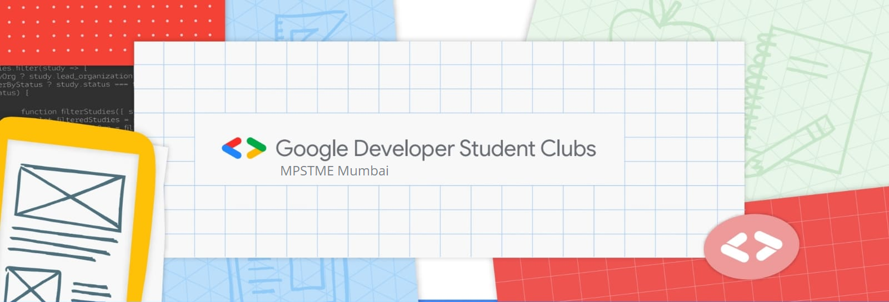
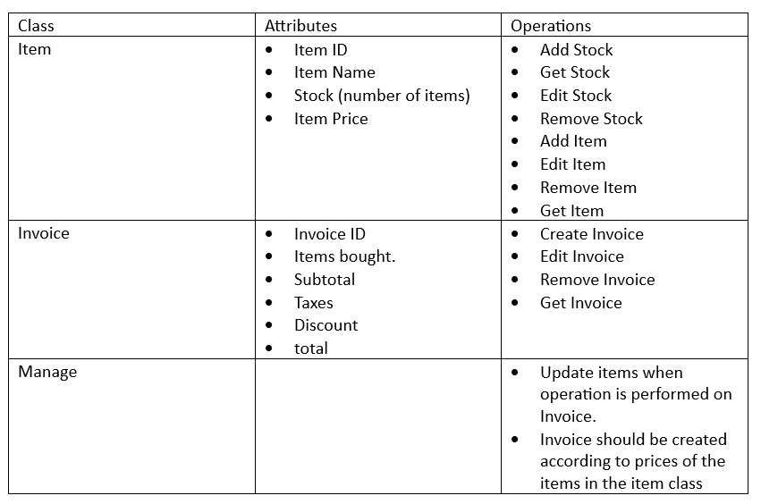

## Welcome to the Web Development Recruitment Task!

Here we will be assessing your web development skills and, more importantly, your willingness to learn. **You may select and solve any 1 of the 2 tasks provided**. Each task focuses on a different aspect of web development. Choose the task based on your strengths and the skills you want to highlight. The details for each task are provided below.

### Task 1 - Frontend Development

Task 1 will focus on Frontend Web Development.

Given [this Figma design](https://www.figma.com/file/8OMcUNnetlpVDLyKkIYR8s/GDSC-Web-Dev-Recruitment-Task-1), implement a **responsive website** using technologies of your choice. There are **no restrictions on frameworks**, so feel free to use them if you feel they will assist your development process.  
Note that **making the dark mode design is not mandatory**, but there are bonus points if you do make it.  
While submitting the code **make sure to add screenshots of your implementation at various viewport widths** (desktop - 1024px, tablet - 768px and mobile - 640px) in the README.

### Task 2 - Backend Development

Task 2 will focus on Backend Web Development.

Given the following functional requirements for an **Inventory Management API**, **develop a REST API with appropriate endpoints**. The API should **preferably be developed in Node.js** but, any programming language is acceptable. You are free to use any database of your choice but **a database MUST be used**.

**Functional Requirements:**

While submitting the code **make sure to add API client screenshots with a brief explanation** of the content of each screenshot in the README.

### Important Guidelines:

- **Your solution to the selected task must be uploaded to a GitHub repository. You will submit the solution by submitting the link to your GitHub repository containing your solution.**
- **You can find resources on how to create GitHub repositories and commit code here: [https://rogerdudler.github.io/git-guide/](https://rogerdudler.github.io/git-guide/).**
- **The README of the repo must contain the required information based on the chosen task.**
- **Feel free to make reasonable assumptions and mention them, if any, in the README.**
- **Try to implement as much as you can. You can submit your task even if you are not able to complete it.**
